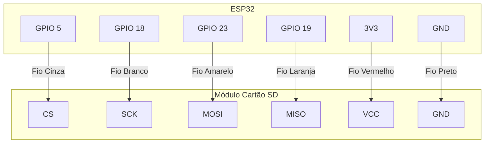

# Projeto ESP32
Este é um projeto de "Internet das Coisas" (IoT) que usa uma placa ESP32 para automatizar o upload de arquivos para um fotagrafo amador.

```mermaid
graph TD
    subgraph ESP32
        A[GPIO 5]
        B[GPIO 18]
        C[GPIO 23]
        D[GPIO 19]
        E[3V3]
        F[GND]
    end

    subgraph Módulo Cartão SD
        G[CS]
        H[SCK]
        I[MOSI]
        J[MISO]
        K[VCC]
        L[GND]
    end

    A -- Fio Cinza --> G
    B -- Fio Branco --> H
    C -- Fio Amarelo --> I
    D -- Fio Laranja --> J
    E -- Fio Vermelho --> K
    F -- Fio Preto --> L
```
